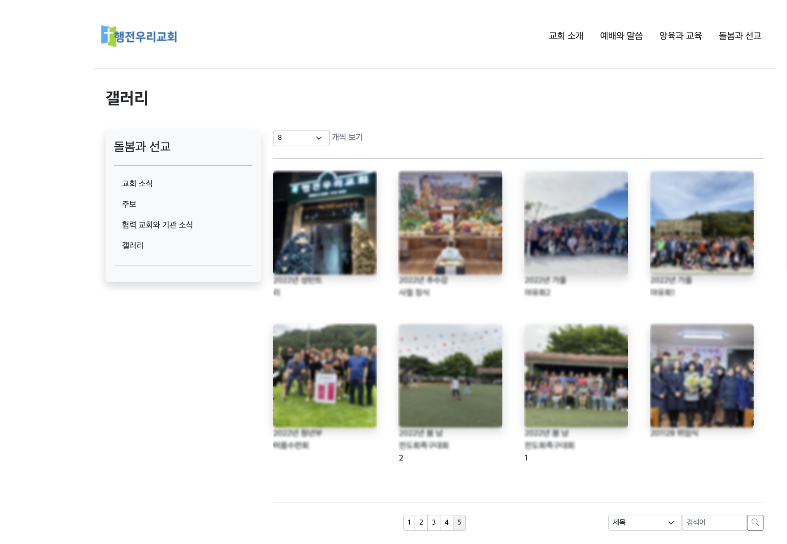

# Save-The-Web
개척교회 홈페이지 제작 팀 프로젝트

<br><br><br>


## 팀원

<table>
  <tbody>
    <tr>
      <td align="center"><a href="https://github.com/dawnpoems"><br /><sub><b>dawnpoems</b></sub></a><br /></td>
      <td align="center"><a href="https://github.com/kimjisudev"><br /><sub><b>kimjisudev</b></sub></a><br /></td>
      <td align="center"><a href="https://github.com/BeomSeokYu"><br /><sub><b>BeomSeokYu</b></sub></a><br /></td>
      <td align="center"><a href="https://github.com/hsnkch"><br /><sub><b>hsnkch</b></sub></a><br /></td>
     <tr/>
      <td align="center"><a href="https://github.com/KyungoeSim"><br /><sub><b>KyungoeSim</b></sub></a><br /></td>
      <td align="center"><a href="https://github.com/hyeokjulee"><br /><sub><b>hyeokjulee</b></sub></a><br /></td>
      <td align="center"><a href="https://github.com/0-light"><br /><sub><b>0-light</b></sub></a><br /></td>
    </tr>
  </tbody>
</table>

<br><br><br>


## 프로젝트 개요

이 프로젝트는 홈페이지가 없어 운영에 어려움이 있는 개척교회를 돕기 위한 봉사 목적으로 개발되었습니다.

#### 프로젝트 목적과 목표
```Plaintext
이제 막 시작한 개척 교회들은 교회 시스템이 마련되지 않아 어려움을 겪고 있으며, 교회의 부흥을 위해 교회를 알리고 정보를 제공할 필요가 있다. 
교회의 홈페이지가 있다면, 교회의 정보를 파악하고 사람들의 접근성을 높이는 데 도움이 될 것이다.
현재 사용되고 있는 교회의 홈페이지들을 보면 무료 홈페이지 제작 플랫폼을 이용해 간단하게 구성하거나, 오래된 사이트가 많아 사용자 경험이 좋지 못한 편이라 정보의 전달이 어려운 편이다. 
이는 젊은 사람들에게는 교회가 올드하다고 느끼며, 교회의 이미지에좋지 못한 영향을 줄 수 있다.
따라서 우리는 교회의 정보 전달에 유리한 심플하며 현대에 맞는 UI/UX를 가지며, 외부사람들에게 교회의 좋은 이미지를 주는 홈페이지를 제작하는 것이 목표이다.
```
#### 프로젝트 배포
- cafe24 호스팅


<br><br><br>


## 기술 스택

#### 🖥️ FE

<a href="https://www.w3.org/TR/html52/" target="_blank">
  
</a>
<a href="https://www.w3.org/Style/CSS/" target="_blank">
  
</a>
<a href="https://developer.mozilla.org/en-US/docs/Web/JavaScript" target="_blank">
  
</a>
<a href="https://jquery.com" target="_blank">
  
</a>
<a href="https://getbootstrap.com" target="_blank">
  
</a>

#### ⌨️ BE

<a href="https://openjdk.java.net" target="_blank">
  
</a>
<a href="https://jsp.dev" target="_blank">
  
</a>
<a href="https://tomcat.apache.org" target="_blank">
  
</a>
<a href="https://tomcat.apache.org" target="_blank">
  
</a>
<br>
<a href="https://www.mysql.com" target="_blank">
  
</a>
<a href="https://mybatis.org" target="_blank">
  
</a>

###
<br><br><br>


## 주요 기능 및 설명
- 교회 소개
    - 교회 위치 지도 표시(Kakao Map API)를 통한 오시는 길 안내
- 일반 게시판
    - 썸머노트([https://summernote.org](https://summernote.org/)) WYSIWYG 에디터를 활용한 게시글 작성 편의성 제공
    - Mybatis 동적 쿼리를 이용한 게시글 수 조정, 옵션 검색 및 페이징 처리
- 갤러리
    - 다중 이미지 파일 업로드
- PDF 업로드
    - PDF 주보 파일을 업로드 하여 PDF.JS (PDF 웹뷰어 범용 웹 표준 기반 플랫폼; [https://mozilla.github.io/pdf.js](https://mozilla.github.io/pdf.js/)) 오픈 소스를 통해 손쉽게 열람하고 다운로드 가능
- JDBC
    - 커넥션 풀(Connection Pool) 사용


<br><br><br>


## 상세 내용
- 노션 페이지 참조 - [이동](https://bsnote.notion.site/3d566ddc67ba4c6988b6dfc786a9121d?pvs=4)


<br><br><br>


## 프로젝트 결과 소개
- ### 홈페이지 URL
  [행전우리교회 (http://actswoori.org)](http://actswoori.org/main.jsp "행전우리교회")

<br>

- ### 메인페이지
  <div align="center">
    
  </div>

- ### 오시는 길
  <div align="center">
    
  </div>

- ### 게시판
  <div align="center">
    
  </div>

- ### 갤러리
  <div align="center">
    
  </div>

- ### 주보
  <div align="center">
    
  </div>

<br><br><br>
